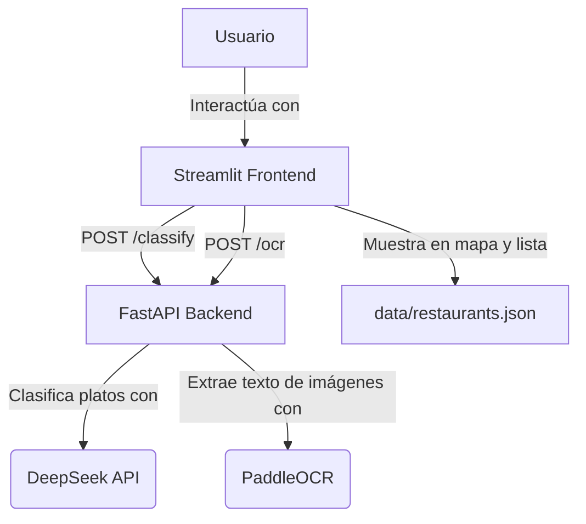

# Aptito

Aptito usa IA para mostrarte qué puedes comer en cualquier restaurante de Lima, seas vegetariano o vegano.

## Arquitectura



## Cómo ejecutar el proyecto localmente

1.  **Clona el repositorio** (o crea los archivos manualmente siguiendo la estructura generada por el script).

2.  **Crea el entorno virtual e instala dependencias del backend:**

    ```bash
    cd backend
    python3 -m venv venv
    source venv/bin/activate
    pip install -r requirements.txt
    ```

3.  **Crea el entorno virtual e instala dependencias del frontend:**

    ```bash
    cd ../frontend
    python3 -m venv venv
    source venv/bin/activate
    pip install -r requirements.txt
    ```

4.  **Configura tus claves API:**

    Copia el archivo `.env.example` a `.env` en el directorio raíz del proyecto y añade tu `DEEPSEEK_API_KEY`.

    ```bash
    cp .env.example .env
    # Abre .env y añade tu clave:
    # DEEPSEEK_API_KEY=tu_clave_aqui
    ```

5.  **Inicia el backend:**

    Asegúrate de estar en el directorio `backend` y con el entorno virtual activado.

    ```bash
    cd backend
    source venv/bin/activate
    python3 -m uvicorn app.main:app --host 0.0.0.0 --port 8000 --reload
    ```

6.  **Inicia el frontend:**

    Abre una nueva terminal, asegúrate de estar en el directorio `frontend` y con el entorno virtual activado.

    ```bash
    cd frontend
    source venv/bin/activate
    streamlit run app.py
    ```

    Esto abrirá la aplicación Streamlit en tu navegador.

## Herramientas de IA utilizadas

*   **DeepSeek API**: Utilizado para la clasificación de platos en 'vegano', 'vegetariano' o 'no_apto'.
*   **PaddleOCR**: Empleado para la extracción de texto (OCR) de las imágenes de cartas de restaurantes.
