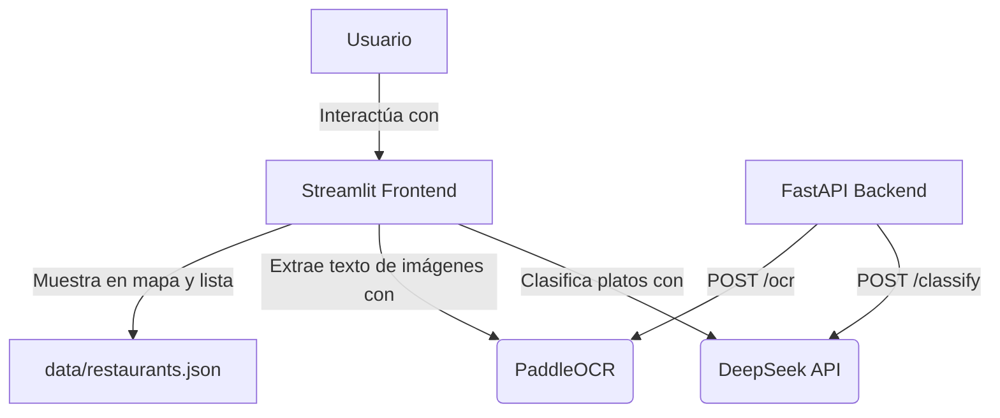

# 🌱 Aptito

Aptito usa IA para mostrarte qué puedes comer en cualquier restaurante de Lima, seas vegetariano o vegano.

## 🚀 Demo en vivo
👉 [Abrir Aptito](https://aptito-jxz2k8pz5ljvaageschyky.streamlit.app)

## Arquitectura

## Herramientas de IA utilizadas

| Herramienta | Uso |
|---|---|
| **DeepSeek API** | Clasifica cada plato como vegano, vegetariano o no apto |
| **PaddleOCR** | Extrae texto de fotos de cartas de restaurante |

## Cómo ejecutar localmente

1. Clona el repositorio
2. Copia `.env.example` a `.env` y agrega tu `DEEPSEEK_API_KEY`
3. Instala dependencias: `pip install -r frontend/requirements.txt`
4. Corre: `streamlit run frontend/app.py`

## Estructura del proyecto

aptito/

├── data/restaurants.json

├── ai/classifier.py

├── backend/app/main.py

├── frontend/app.py

├── docs/

├── .env.example

└── README.md

## Autor
Tamara Carrero — Universidad del Pacífico, 2026
